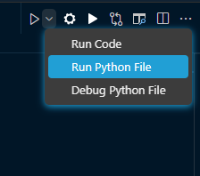

<!-- HEADINGD -->
# Rozwiązania przykładowych zadań z matury z informatyki

*Aby uruchomić programy trzeba mieć zainstalowany na swoim komputerze kompilator języka python 
[Link](https://www.python.org/downloads/), wersję języka z jakiej korzystamy możemy bezpośrednio sprawdzić w Visual Studio Code*


*Program najlepiej uruchomić za pomocą **run python file***



*Znajdziemy to w prawym górnym rogu okna*
*Jeżeli nie mamy takiej opcji, to z lewego paska narzędzi należy wybrać _Extensions_ (Ctrl+Shift+X) i zainstalować rozszerzenie języka python*

### Stałe elementy każdego zadania:

Na początku zadań należy zaimportować pliki potrzebne do wykonania zadania 
```python
    file = open('Tutaj podaj ścieżkę do pliku w którym znajdują się dane do zadania', 'r')
    answer_file = open('Tutaj podaj ścieżkę do pliku do którego zapiszesz odpowiedź', 'w';)
```
Dane z pliku zapisujemy do zmiennej text za pomocą wbudowanej funkcji readlines()

```python
    text = file.readlines()
```

Należy zamknąć również pliki w celu zwolnienia pamięci.
```python
file.close()
answer_file.close()
```
---
## Zadanie - WEGA
### Egzamin Maturalny z Informatyki rok 2018

<!-- LINK -->


>**Materiały do zadania:**

> **[Arkusz Egzaminacyjny](https://cke.gov.pl/images/_EGZAMIN_MATURALNY_OD_2015/Arkusze_egzaminacyjne/2018/formula_od_2015/informatyka/MIN-R2_1P-182.pdf)** 

> [Zasady oceniania](https://cke.gov.pl/images/_EGZAMIN_MATURALNY_OD_2015/Arkusze_egzaminacyjne/2018/formula_od_2015/Zasady_oceniania/MIN-R2_1P-182_zasady_oceniania.pdf)

<!-- Tasks -->

| Numer zadania | Plik z programem |
| --------------|------------------|
|4.1 |**[Kliknij](./WEGA2018/main.py)**|
|4.2 |**[Kliknij](./WEGA2018/main2.py)**|
|4.3 |**[Kliknij](./WEGA2018/main3.py)**|

Wyniki: **[Kliknij](./WEGA2018/wyniki4.txt)**

---

## Zadanie - BINARNIE
### Egzamin Maturalny z Informatyki rok 2015

<!-- LINK -->


>**Materiały do zadania:**

> **[Arkusz Egzaminacyjny](https://cke.gov.pl/images/_EGZAMIN_MATURALNY_OD_2015/Arkusze_egzaminacyjne/2015/formula_od_2015/MIN-R2_1P-152.pdf)** 

> [Zasady oceniania](https://cke.gov.pl/images/_EGZAMIN_MATURALNY_OD_2015/Arkusze_egzaminacyjne/2015/formula_od_2015/odpowiedzi/MIN-R1-N.pdf)

<!-- Tasks -->

| Numer zadania | Plik z programem |
| --------------|------------------|
|4.1 |**[Kliknij](./BINARNY2015/main.py)**|
|4.2 |**[Kliknij](./BINARNY2015/main2.py)**|
|4.3|**[Kliknij](./BINARNY2015/main3.py)**|

Wyniki: **[Kliknij](./BINARNY2015/wyniki4.txt)**

---

## Zadanie - SZYFR CEZARA
### Egzamin Maturalny z Informatyki rok 2016

<!-- LINK -->


>**Materiały do zadania:**

> **[Arkusz Egzaminacyjny](https://cke.gov.pl/images/_EGZAMIN_MATURALNY_OD_2015/Arkusze_egzaminacyjne/2016/formula_od_2015/MIN-R2_1P-162.pdf)** 

> [Zasady oceniania](https://cke.gov.pl/images/_EGZAMIN_MATURALNY_OD_2015/Arkusze_egzaminacyjne/2016/formula_od_2015/zasady_oceniania/MIN-R1-N.pdf)

<!-- Tasks -->

| Numer zadania | Plik z programem |
| --------------|------------------|
|6.1 |**[Kliknij](./CEZAR2016/main.py)**|
|6.2 |**[Kliknij](./CEZAR2016/main2.py)**|
|6.3 |**[Kliknij](./CEZAR2016/main3.py)**|

|Numer zadania |Plik z wynikami |
|--------------|----------------|
|6.1 |**[Wyniki](./CEZAR2016/wyniki_6_1.txt)**|
|6.2 |**[Wyniki](./CEZAR2016/wyniki_6_2.txt)**|
|6.3 |**[Wyniki](./CEZAR2016/wyniki_6_3.txt)**|

---

## Zadanie - SYSTEMY LICZBOWE
### Egzamin maturalny z informatyki - czerwiec 2016


>**Materiały do zadań**

>**[Arkusz Egzaminacyjny](https://arkusze.pl/maturalne/informatyka-2016-czerwiec-matura-rozszerzona-2.pdf)**

>[Zasady oceniania](https://arkusze.pl/maturalne/informatyka-2016-czerwiec-matura-rozszerzona-odpowiedzi.pdf)

<!-- Tasks -->
| Numer zadania | Plik z programem |
| --------------|------------------|
|6.1 |**[Kliknij](./SYSTEMY2016/main.py)**|
|6.2 |**[Kliknij](./SYSTEMY2016/main2.py)**|
|6.3 |**[Kliknij](./SYSTEMY2016/main3.py)**|
|6.4 |**[Kliknij](./SYSTEMY2016/main4.py)**|
|6.5 |**[Kliknij](./SYSTEMY2016/main5.py)**|


|Numer zadania |Plik z wynikami |
|--------------|----------------|
|6.1 |**[Wyniki](./SYSTEMY2016/wyniki_6_1.txt)**|
|6.2 |**[Wyniki](./SYSTEMY2016/wyniki_6_2.txt)**|
|6.3 |**[Wyniki](./SYSTEMY2016/wyniki_6_3.txt)**|
|6.4 |**[Wyniki](./SYSTEMY2016/wyniki_6_4.txt)**|
|6.5 |**[Wyniki](./SYSTEMY2016/wyniki_6_5.txt)**|


